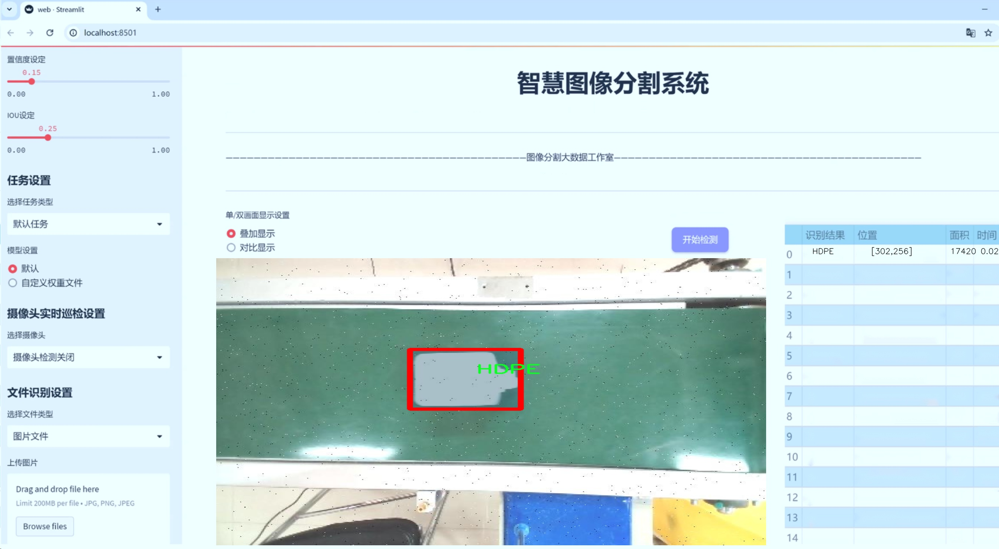
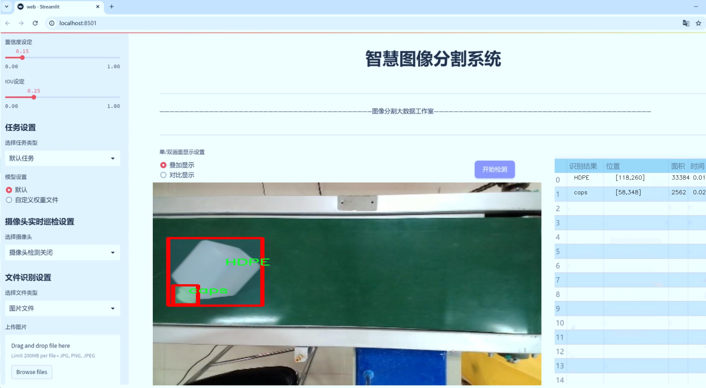
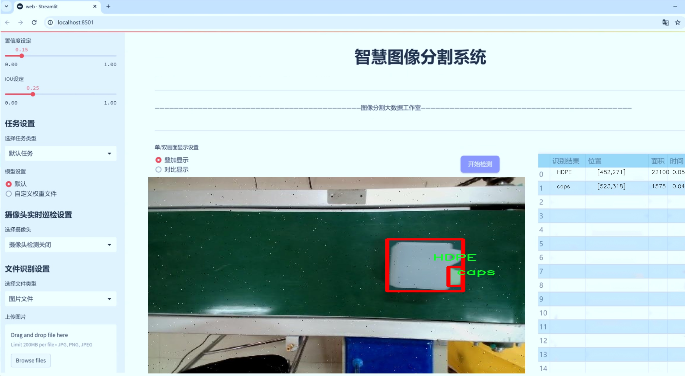
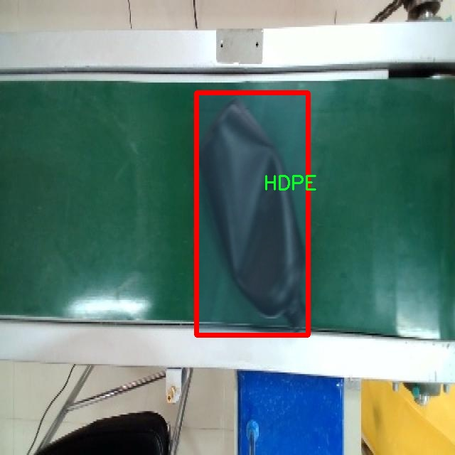
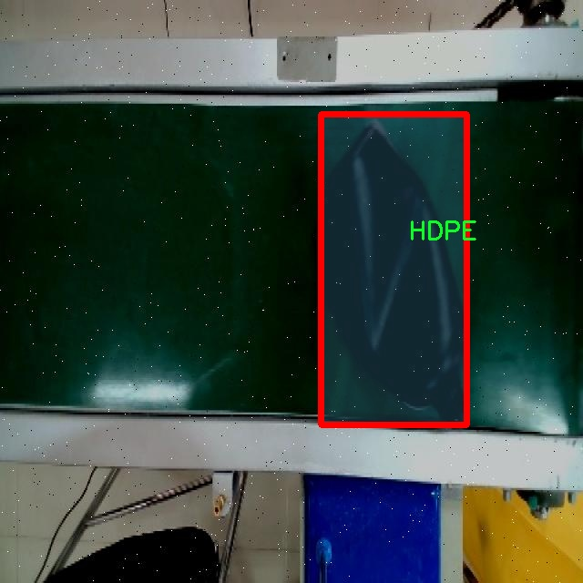
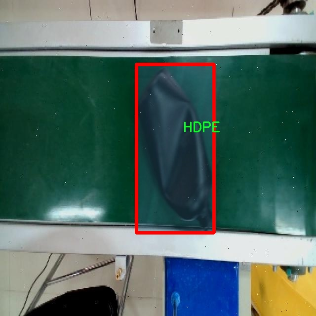
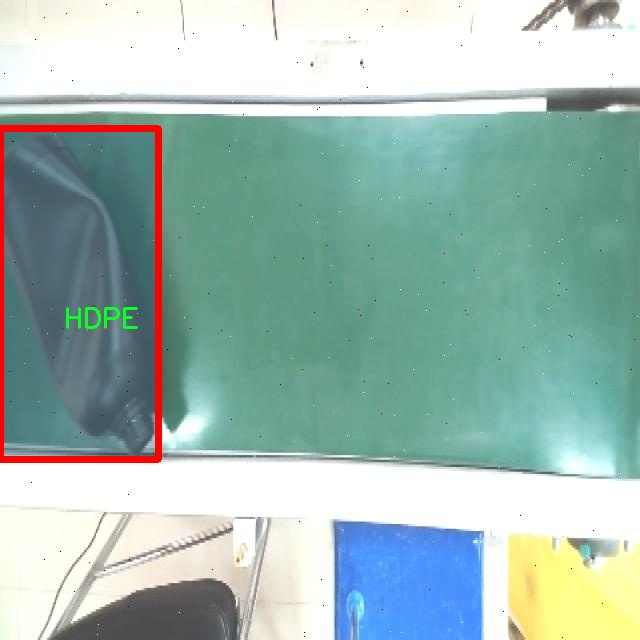
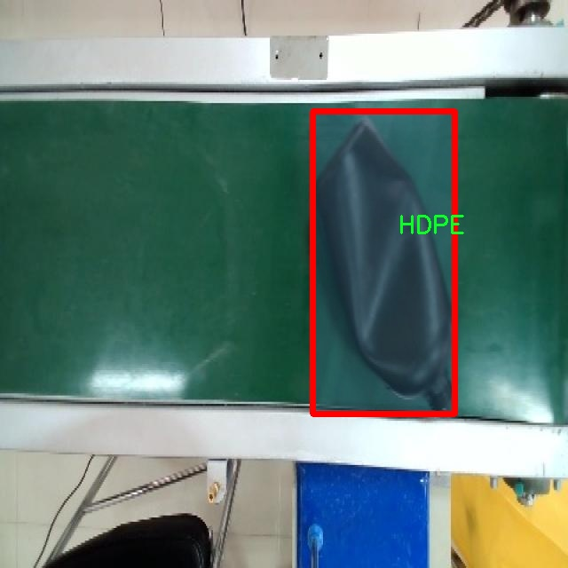

# 生产线瓶子缺陷图像分割系统源码＆数据集分享
 [yolov8-seg-C2f-ContextGuided＆yolov8-seg-C2f-EMSCP等50+全套改进创新点发刊_一键训练教程_Web前端展示]

### 1.研究背景与意义

项目参考[ILSVRC ImageNet Large Scale Visual Recognition Challenge](https://gitee.com/YOLOv8_YOLOv11_Segmentation_Studio/projects)

项目来源[AAAI Global Al lnnovation Contest](https://kdocs.cn/l/cszuIiCKVNis)

研究背景与意义

随着工业自动化和智能制造的快速发展，生产线上的质量控制愈发重要。瓶子作为日常消费品的主要包装形式，其生产过程中的缺陷检测直接关系到产品的质量和企业的经济效益。传统的人工检测方法不仅效率低下，而且容易受到人为因素的影响，导致漏检和误判。因此，基于计算机视觉的自动化缺陷检测系统应运而生，成为提升生产效率和保证产品质量的重要手段。

在众多计算机视觉技术中，目标检测与图像分割技术尤为关键。YOLO（You Only Look Once）系列模型因其高效的实时检测能力而广泛应用于各种视觉任务。YOLOv8作为该系列的最新版本，结合了深度学习的最新进展，具备了更强的特征提取能力和更高的检测精度。然而，尽管YOLOv8在目标检测方面表现优异，但在复杂背景下的图像分割任务仍然面临挑战，尤其是在多类别瓶子缺陷的检测中。因此，改进YOLOv8以适应生产线瓶子缺陷图像分割的需求，具有重要的研究意义。

本研究将基于3700张包含三类缺陷（HDPE、PET及瓶盖）的图像数据集，构建一个高效的瓶子缺陷图像分割系统。该数据集的多样性和丰富性为模型的训练和验证提供了良好的基础，能够有效提高模型在实际应用中的泛化能力。通过对YOLOv8模型的改进，旨在提升其在复杂背景下的分割精度，特别是在处理不同材质和形状的瓶子缺陷时，能够更准确地识别和分割出缺陷区域。这不仅能够提高缺陷检测的准确性，还能为后续的质量控制和生产优化提供数据支持。

此外，瓶子缺陷检测的研究不仅具有理论价值，还具有广泛的实际应用前景。通过实现高效的自动化检测系统，可以显著降低人工成本，提高生产效率，减少因产品缺陷带来的经济损失。同时，该系统的成功应用还可以为其他领域的缺陷检测提供借鉴，推动计算机视觉技术在工业自动化中的进一步发展。

综上所述，基于改进YOLOv8的生产线瓶子缺陷图像分割系统的研究，不仅填补了现有技术在多类别缺陷检测中的空白，还为智能制造的实现提供了新的思路和方法。通过本研究的深入，期望能够为瓶子生产行业的质量控制提供有效的技术支持，推动整个行业的智能化转型。

### 2.图片演示







##### 注意：由于此博客编辑较早，上面“2.图片演示”和“3.视频演示”展示的系统图片或者视频可能为老版本，新版本在老版本的基础上升级如下：（实际效果以升级的新版本为准）

  （1）适配了YOLOV8的“目标检测”模型和“实例分割”模型，通过加载相应的权重（.pt）文件即可自适应加载模型。

  （2）支持“图片识别”、“视频识别”、“摄像头实时识别”三种识别模式。

  （3）支持“图片识别”、“视频识别”、“摄像头实时识别”三种识别结果保存导出，解决手动导出（容易卡顿出现爆内存）存在的问题，识别完自动保存结果并导出到tempDir中。

  （4）支持Web前端系统中的标题、背景图等自定义修改，后面提供修改教程。

  另外本项目提供训练的数据集和训练教程,暂不提供权重文件（best.pt）,需要您按照教程进行训练后实现图片演示和Web前端界面演示的效果。

### 3.视频演示

[3.1 视频演示](https://www.bilibili.com/video/BV1oHmPYwEPZ/)

### 4.数据集信息展示

##### 4.1 本项目数据集详细数据（类别数＆类别名）

nc: 3
names: ['HDPE', 'PET', 'caps']


##### 4.2 本项目数据集信息介绍

数据集信息展示

在现代制造业中，生产线的质量控制至关重要，尤其是在瓶子生产过程中，确保产品的完好无损是提升企业竞争力的关键因素之一。为此，我们构建了一个名为“Bottle Defect Detection”的数据集，旨在为改进YOLOv8-seg的瓶子缺陷图像分割系统提供丰富的训练素材。该数据集专注于三种主要类别的瓶子及其缺陷，具体包括HDPE（高密度聚乙烯）、PET（聚对苯二甲酸乙二醇酯）和瓶盖（caps）。通过对这些类别的深入分析和标注，我们希望能够提升缺陷检测的准确性和效率。

“Bottle Defect Detection”数据集的构建过程涉及了大量的图像采集和处理工作。我们从多个生产线中收集了大量的瓶子图像，确保样本的多样性和代表性。这些图像不仅涵盖了不同类型的瓶子，还包括了各种常见的缺陷，如划痕、凹陷、气泡和颜色不均等。为了保证数据集的高质量，我们对每一张图像进行了精细的标注，确保每个缺陷都能被准确识别和分类。标注工作不仅要求标注员具备一定的专业知识，还需要他们对瓶子生产过程有深入的理解，以便能够识别出微小的缺陷。

在数据集的类别设置上，我们选择了三种关键的类别，分别是HDPE、PET和瓶盖。这三种材料在瓶子生产中占据了重要地位，且各自具有不同的物理特性和生产工艺。HDPE瓶子通常用于包装乳制品和清洁剂，其优良的抗冲击性和耐化学性使其成为广泛应用的选择。PET瓶子则因其轻便和透明性，常用于饮料和食品包装。而瓶盖作为瓶子的封闭部分，其质量直接影响到产品的密封性和保鲜效果。因此，针对这三种类别的缺陷检测，不仅能够提高生产效率，还能有效降低因缺陷导致的产品损失。

在训练YOLOv8-seg模型时，我们将利用“Bottle Defect Detection”数据集中的图像进行深度学习。该模型通过卷积神经网络（CNN）提取图像特征，并通过分割算法实现对瓶子及其缺陷的精准定位。数据集中的每一类样本都将为模型提供必要的训练数据，使其能够学习到不同类别瓶子的特征及其常见缺陷的表现形式。通过不断迭代训练和优化，我们期望模型能够在实际应用中实现高效、准确的缺陷检测，从而为生产线的质量控制提供强有力的技术支持。

总之，“Bottle Defect Detection”数据集不仅是一个用于训练YOLOv8-seg模型的重要资源，更是推动瓶子生产质量提升的重要工具。通过对数据集的深入分析和应用，我们相信能够为行业带来显著的效益，并为未来的智能制造奠定坚实的基础。











### 5.全套项目环境部署视频教程（零基础手把手教学）

[5.1 环境部署教程链接（零基础手把手教学）](https://www.bilibili.com/video/BV1jG4Ve4E9t/?vd_source=bc9aec86d164b67a7004b996143742dc)


[5.2 安装Python虚拟环境创建和依赖库安装视频教程链接（零基础手把手教学）](https://www.bilibili.com/video/BV1nA4VeYEze/?vd_source=bc9aec86d164b67a7004b996143742dc)

### 6.手把手YOLOV8-seg训练视频教程（零基础小白有手就能学会）

[6.1 手把手YOLOV8-seg训练视频教程（零基础小白有手就能学会）](https://www.bilibili.com/video/BV1cA4VeYETe/?vd_source=bc9aec86d164b67a7004b996143742dc)


按照上面的训练视频教程链接加载项目提供的数据集，运行train.py即可开始训练



     Epoch   gpu_mem       box       obj       cls    labels  img_size
     1/200     0G   0.01576   0.01955  0.007536        22      1280: 100%|██████████| 849/849 [14:42<00:00,  1.04s/it]
               Class     Images     Labels          P          R     mAP@.5 mAP@.5:.95: 100%|██████████| 213/213 [01:14<00:00,  2.87it/s]
                 all       3395      17314      0.994      0.957      0.0957      0.0843

     Epoch   gpu_mem       box       obj       cls    labels  img_size
     2/200     0G   0.01578   0.01923  0.007006        22      1280: 100%|██████████| 849/849 [14:44<00:00,  1.04s/it]
               Class     Images     Labels          P          R     mAP@.5 mAP@.5:.95: 100%|██████████| 213/213 [01:12<00:00,  2.95it/s]
                 all       3395      17314      0.996      0.956      0.0957      0.0845

     Epoch   gpu_mem       box       obj       cls    labels  img_size
     3/200     0G   0.01561    0.0191  0.006895        27      1280: 100%|██████████| 849/849 [10:56<00:00,  1.29it/s]
               Class     Images     Labels          P          R     mAP@.5 mAP@.5:.95: 100%|███████   | 187/213 [00:52<00:00,  4.04it/s]
                 all       3395      17314      0.996      0.957      0.0957      0.0845


### 7.50+种全套YOLOV8-seg创新点代码加载调参视频教程（一键加载写好的改进模型的配置文件）

[7.1 50+种全套YOLOV8-seg创新点代码加载调参视频教程（一键加载写好的改进模型的配置文件）](https://www.bilibili.com/video/BV1Hw4VePEXv/?vd_source=bc9aec86d164b67a7004b996143742dc)

### 8.YOLOV8-seg图像分割算法原理

原始YOLOv8-seg算法原理

YOLOv8-seg算法是Ultralytics公司在2023年推出的最新目标检测和图像分割模型，基于YOLO系列的成功经验，进一步优化了网络结构和算法性能。YOLOv8-seg不仅继承了YOLO系列的快速和高效的设计理念，还引入了多项创新技术，使其在目标检测和图像分割任务中表现出色。

YOLOv8-seg的网络结构主要由输入层、主干网络、颈部网络和输出层组成。输入层负责处理输入图像，默认的输入尺寸为640x640像素。为了适应不同长宽比的图像，YOLOv8-seg采用自适应图像缩放技术，将长边按比例缩小到指定尺寸，并对短边进行填充。这种方法不仅减少了填充区域的冗余信息，还提高了目标检测和推理的速度。此外，在训练过程中，YOLOv8-seg引入了Mosaic数据增强技术，通过随机拼接四张不同的图像，增强了模型对不同场景和目标位置的学习能力，显著提升了模型的泛化能力和预测精度。

在主干网络部分，YOLOv8-seg对传统的C3模块进行了改进，采用了C2F模块。这一模块借鉴了YOLOv7中的ELAN结构，通过并行的梯度流分支，增强了特征提取的能力。C2F模块不仅提高了模型的精度，还在保持轻量化的同时，减少了计算延迟。主干网络的最后，YOLOv8-seg使用了SPP（Spatial Pyramid Pooling）模块，通过多尺度池化处理，进一步增强了特征的抽象能力，使得模型能够更好地处理不同尺度的目标。

颈部网络是YOLOv8-seg的关键部分，它通过路径聚合网络（PAN）结构，将来自主干网络的不同尺度特征图进行融合。通过上采样和下采样操作，颈部网络能够有效地整合多层次的特征信息，增强了模型对复杂场景的理解能力。这一设计使得YOLOv8-seg在处理多尺度目标时，能够更好地捕捉到目标的细节信息，提高了检测和分割的精度。

在输出层，YOLOv8-seg采用了解耦的检测头结构。与传统的耦合头不同，解耦头将分类和回归任务分开处理，通过两个独立的卷积分支分别计算类别和边界框的位置。这种设计不仅提高了模型的准确性，还简化了损失函数的计算。在损失函数方面，YOLOv8-seg使用了分布焦点损失（DFL）和CIoU损失，这些损失函数能够更好地引导模型快速聚焦于目标的真实位置，进一步提升了检测和分割的性能。

YOLOv8-seg的另一个重要创新是其无锚框（Anchor-Free）的方法。传统的锚框方法需要预设多个锚框以适应不同目标的大小和形状，这不仅增加了计算复杂度，还降低了模型的灵活性。YOLOv8-seg通过将目标检测转化为关键点检测，避免了对锚框的依赖，使得模型在处理多样化的目标时具有更强的适应性和更高的检测精度。

在实际应用中，YOLOv8-seg表现出了优异的性能。其在COCOval2017数据集上的测试结果显示，YOLOv8-seg在准确性和速度上均优于前几代YOLO模型。这使得YOLOv8-seg成为目标检测和图像分割任务的理想选择，广泛应用于自动驾驶、安防监控、医学影像分析等领域。

然而，尽管YOLOv8-seg在许多场景中表现出色，但在某些复杂环境下，如水面漂浮物检测，仍然存在一些挑战。这些小目标往往具有复杂的特征和多样的背景，导致模型在定位和感知能力上存在不足。为了解决这些问题，研究者们提出了针对YOLOv8-seg的改进方案，例如引入双层路由注意力机制的C2fBF模块，以保留特征提取过程中的细粒度上下文信息，增强对小目标的感知能力。

综上所述，YOLOv8-seg算法通过一系列创新的设计和改进，提升了目标检测和图像分割的性能，展现了强大的应用潜力。随着技术的不断发展，YOLOv8-seg有望在更多领域中发挥重要作用，为智能视觉系统的构建提供更为强大的支持。


### 9.系统功能展示（检测对象为举例，实际内容以本项目数据集为准）

图9.1.系统支持检测结果表格显示

  图9.2.系统支持置信度和IOU阈值手动调节

  图9.3.系统支持自定义加载权重文件best.pt(需要你通过步骤5中训练获得)

  图9.4.系统支持摄像头实时识别

  图9.5.系统支持图片识别

  图9.6.系统支持视频识别

  图9.7.系统支持识别结果文件自动保存

  图9.8.系统支持Excel导出检测结果数据


### 10.50+种全套YOLOV8-seg创新点原理讲解（非科班也可以轻松写刊发刊，V11版本正在科研待更新）

#### 10.1 由于篇幅限制，每个创新点的具体原理讲解就不一一展开，具体见下列网址中的创新点对应子项目的技术原理博客网址【Blog】：


[10.1 50+种全套YOLOV8-seg创新点原理讲解链接](https://gitee.com/qunmasj/good)

#### 10.2 部分改进模块原理讲解(完整的改进原理见上图和技术博客链接)【如果此小节的图加载失败可以通过CSDN或者Github搜索该博客的标题访问原始博客，原始博客图片显示正常】
### 可变性卷积DCN简介
卷积神经网络由于其构建模块中固定的几何结构，本质上受限于模型几何变换。为了提高卷积神经网络的转换建模能力，《Deformable Convolutional Networks》作者提出了两个模块：可变形卷积（deformable convolution）和可变形RoI池（deformable RoI pooling）。这两个模块均基于用额外的偏移来增加模块中的空间采样位置以及从目标任务中学习偏移的思想，而不需要额外的监督。

第一次证明了在深度神经网络中学习密集空间变换（dense spatial transformation）对于复杂的视觉任务是有效的

视觉识别中的一个关键挑战是如何适应对象比例、姿态、视点和零件变形中的几何变化或模型几何变换。一般有两种方法实现：
1）建立具有足够期望变化的训练数据集。这通常通过增加现有的数据样本来实现，例如通过仿射变换。但是训练成本昂贵而且模型参数庞大。
2）使用变换不变（transformation-invariant）的特征和算法。比如比较有名的SIFT(尺度不变特征变换)便是这一类的代表算法。

但以上的方法有两个缺点：
1）几何变换被假定为固定的和已知的，这些先验知识被用来扩充数据，设计特征和算法。为此，这个假设阻止了对具有未知几何变换的新任务的推广，从而导致这些几何变换可能没有被正确建模。
2）对于不变特征和算法进行手动设计，对于过于复杂的变换可能是困难的或不可行的。

卷积神经网络本质上局限于模拟大型未知转换。局限性源于CNN模块的固定几何结构：卷积单元在固定位置对输入特征图进行采样；池化层以固定比率降低特征矩阵分辨率；RoI（感兴趣区域）池化层将RoI分成固定的空间箱（spatial bins）等。缺乏处理几何变换的内部机制。

这种内部机制的缺乏会导致一些问题，举个例子。同一个CNN层中所有激活单元的感受野大小是相同的，但是这是不可取的。因为不同的位置可能对应于具有不同尺度或变形的对象，所以尺度或感受野大小的自适应确定对于具有精细定位的视觉识别是渴望的。

对于这些问题，作者提出了两个模块提高CNNs对几何变换建模的能力。


deformable convolution（可变形卷积）
将2D偏移量添加到标准卷积中的常规网格采样位置，使得采样网格能够自由变形。通过额外的卷积层，从前面的特征映射中学习偏移。因此，变形采用局部、密集和自适应的方式取决于输入特征。


deformable RoI pooling（可变形RoI池化）
为先前RoI池化的常规库（bin）分区中的每个库位置（bin partition）增加了一个偏移量。类似地，偏移是从前面的特征图和感兴趣区域中学习的，从而能够对具有不同形状的对象进行自适应部件定位（adaptive part localization）。

#### Deformable Convolutional Networks
Deformable Convolution
2D卷积由两个步骤组成：
1）在输入特征图x xx上使用规则网格R RR进行采样。
2）把这些采样点乘不同权重w ww后相加。

网格R定义感受野大小和扩张程度，比如内核大小为3x3，扩张程度为1的网格R可以表示为：
R = { ( − 1 , − 1 ) , ( − 1 , 0 ) , … , ( 0 , 1 ) , ( 1 , 1 ) } R = \{(-1,-1),(-1,0),\dots,(0,1),(1,1)\}
R={(−1,−1),(−1,0),…,(0,1),(1,1)}

​
 一般为小数，使用双线性插值进行处理。（把小数坐标分解到相邻的四个整数坐标点来计算结果）


具体操作如图所示：


首先对输入特征层进行一个普通的3x3卷积处理得到偏移域（offset field）。偏移域特征图具有与输入特征图相同的空间分辨率，channels维度2N对应于N个2D（xy两个方向）偏移。其中的N是原输入特征图上所具有的N个channels，也就是输入输出channels保持不变，这里xy两个channels分别对输出特征图上的一个channels进行偏移。确定采样点后就通过与相对应的权重w点乘相加得到输出特征图上该点最终值。

前面也提到过，由于这里xy两个方向所训练出来的偏移量一般来说是一个小数，那么为了得到这个点所对应的数值，会采用双线性插值的方法，从最近的四个邻近坐标点中计算得到该偏移点的数值，公式如下：


具体推理过程见：双线性插值原理

#### Deformable RoI Poolingb
所有基于区域提议（RPN）的对象检测方法都使用RoI池话处理，将任意大小的输入矩形区域转换为固定大小的特征图。


 一般为小数，需要使用双线性插值进行处理。


具体操作如图所示：


当时看这个部分的时候觉得有些突兀，明明RoI池化会将特征层转化为固定尺寸的区域。其实，我个人觉得，这个部分与上述的可变性卷积操作是类似的。这里同样是使用了一个普通的RoI池化操作，进行一些列处理后得到了一个偏移域特征图，然后重新作用于原来的w × H w \times Hw×H的RoI。只不过这里不再是规律的逐行逐列对每个格子进行池化，而是对于格子进行偏移后再池化处理。

#### Postion﹣Sensitive RoI Pooling
除此之外，论文还提出一种PS RoI池化（Postion﹣Sensitive RoI Pooling）。不同于上述可变形RoI池化中的全连接过程，这里使用全卷积替换。

具体操作如图所示：


首先，对于原来的特征图来说，原本是将输入特征图上的RoI区域分成k × k k\times kk×k个bin。而在这里，则是将输入特征图进行卷积操作，分别得到一个channels为k 2 ( C + 1 ) k^{2}(C+1)k (C+1)的得分图（score maps）和一个channels为2 k 2 ( C + 1 ) 2k{2}(C+1)2k 2 (C+1)的偏移域（offset fields），这两个特征矩阵的宽高是与输入特征矩阵相同的。其中，得分图的channels中，k × k k \times kk×k分别表示的是每一个网格，C CC表示的检测对象的类别数目，1表示背景。而在偏移域中的2表示xy两个方向的偏移。
也就是说，在PS RoI池化中，对于RoI的每一个网格都独自占一个通道形成一层得分图，然后其对于的偏移量占两个通道。offset fields得到的偏移是归一化后的偏移，需要通过和deformable RoI pooling中一样的变换方式得到∆ p i j ∆p_{ij}∆p ij，然后对每层得分图进行偏移池化处理。最后处理完的结果就对应着最后输出的一个网格。所以其包含了位置信息。

原文论述为：


#### Understanding Deformable ConvNets
当可变形卷积叠加时，复合变形的效果是深远的。如图所示：


ps：a是标准卷积的固定感受野，b是可变形卷积的适应性感受野。

感受野和标准卷积中的采样位置在整个顶部特征图上是固定的(左)。在可变形卷积中，它们根据对象的比例和形状进行自适应调整(右)。


### 11.项目核心源码讲解（再也不用担心看不懂代码逻辑）

#### 11.1 ui.py

以下是代码的核心部分，并附上详细的中文注释：

```python
import sys
import subprocess

def run_script(script_path):
    """
    使用当前 Python 环境运行指定的脚本。

    Args:
        script_path (str): 要运行的脚本路径

    Returns:
        None
    """
    # 获取当前 Python 解释器的路径
    python_path = sys.executable

    # 构建运行命令，使用 streamlit 运行指定的脚本
    command = f'"{python_path}" -m streamlit run "{script_path}"'

    # 执行命令
    result = subprocess.run(command, shell=True)
    # 检查命令执行的返回码，若不为0则表示出错
    if result.returncode != 0:
        print("脚本运行出错。")

# 主程序入口
if __name__ == "__main__":
    # 指定要运行的脚本路径
    script_path = "web.py"  # 假设脚本在当前目录下

    # 调用函数运行脚本
    run_script(script_path)
```

### 代码核心部分说明：
1. **导入模块**：
   - `sys`：用于获取当前 Python 解释器的路径。
   - `subprocess`：用于执行外部命令。

2. **`run_script` 函数**：
   - 接受一个参数 `script_path`，表示要运行的 Python 脚本的路径。
   - 使用 `sys.executable` 获取当前 Python 解释器的路径。
   - 构建一个命令字符串，使用 `streamlit` 模块运行指定的脚本。
   - 使用 `subprocess.run` 执行命令，并检查返回码以判断脚本是否成功运行。

3. **主程序入口**：
   - 使用 `if __name__ == "__main__":` 确保代码只在直接运行时执行。
   - 指定要运行的脚本路径（在此示例中为 `web.py`）。
   - 调用 `run_script` 函数来执行脚本。

这个文件是一个 Python 脚本，主要功能是运行一个名为 `web.py` 的脚本，使用的是 Streamlit 框架。文件首先导入了一些必要的模块，包括 `sys`、`os` 和 `subprocess`，以及一个自定义的 `abs_path` 函数，用于获取文件的绝对路径。

在 `run_script` 函数中，首先获取当前 Python 解释器的路径，这样可以确保在正确的环境中运行脚本。接着，构建一个命令字符串，该命令使用 Streamlit 运行指定的脚本。具体来说，命令格式为 `"{python_path}" -m streamlit run "{script_path}"`，其中 `python_path` 是当前 Python 解释器的路径，`script_path` 是要运行的脚本的路径。

随后，使用 `subprocess.run` 方法执行这个命令。如果脚本运行失败（即返回码不为 0），则打印出“脚本运行出错”的提示信息。

在文件的最后部分，使用 `if __name__ == "__main__":` 来确保当该脚本作为主程序运行时才会执行后面的代码。在这里，指定了要运行的脚本路径为 `web.py`，并调用 `run_script` 函数来执行这个脚本。

总体来说，这个脚本的作用是方便地启动一个 Streamlit 应用，确保在当前 Python 环境中运行，并处理可能出现的错误。

#### 11.2 ultralytics\utils\callbacks\clearml.py

以下是经过简化并添加详细中文注释的核心代码部分：

```python
# 导入必要的库
from ultralytics.utils import LOGGER, SETTINGS, TESTS_RUNNING

# 尝试导入 ClearML 库并进行基本的设置检查
try:
    assert not TESTS_RUNNING  # 确保不在测试模式下
    assert SETTINGS['clearml'] is True  # 确保 ClearML 集成已启用
    import clearml
    from clearml import Task
    from clearml.binding.frameworks.pytorch_bind import PatchPyTorchModelIO
    from clearml.binding.matplotlib_bind import PatchedMatplotlib

    assert hasattr(clearml, '__version__')  # 确保 ClearML 包已正确安装

except (ImportError, AssertionError):
    clearml = None  # 如果导入失败，则将 clearml 设置为 None


def _log_debug_samples(files, title='Debug Samples') -> None:
    """
    将文件（图像）作为调试样本记录到 ClearML 任务中。

    参数:
        files (list): PosixPath 格式的文件路径列表。
        title (str): 用于分组相同值图像的标题。
    """
    import re

    task = Task.current_task()  # 获取当前任务
    if task:
        for f in files:
            if f.exists():  # 检查文件是否存在
                it = re.search(r'_batch(\d+)', f.name)  # 提取批次号
                iteration = int(it.groups()[0]) if it else 0  # 获取迭代次数
                task.get_logger().report_image(title=title,
                                               series=f.name.replace(it.group(), ''),
                                               local_path=str(f),
                                               iteration=iteration)  # 记录图像


def on_pretrain_routine_start(trainer):
    """在预训练例程开始时运行；初始化并连接/记录任务到 ClearML。"""
    try:
        task = Task.current_task()  # 获取当前任务
        if task:
            # 确保自动的 PyTorch 和 Matplotlib 绑定被禁用
            PatchPyTorchModelIO.update_current_task(None)
            PatchedMatplotlib.update_current_task(None)
        else:
            # 初始化一个新的 ClearML 任务
            task = Task.init(project_name=trainer.args.project or 'YOLOv8',
                             task_name=trainer.args.name,
                             tags=['YOLOv8'],
                             output_uri=True,
                             reuse_last_task_id=False,
                             auto_connect_frameworks={
                                 'pytorch': False,
                                 'matplotlib': False})
            LOGGER.warning('ClearML 初始化了一个新任务。如果您想远程运行，请在初始化 YOLO 之前添加 clearml-init 并连接您的参数。')
        task.connect(vars(trainer.args), name='General')  # 连接训练参数
    except Exception as e:
        LOGGER.warning(f'警告 ⚠️ ClearML 已安装但未正确初始化，未记录此运行。{e}')


def on_train_epoch_end(trainer):
    """在 YOLO 训练的每个 epoch 结束时记录调试样本并报告当前训练进度。"""
    task = Task.current_task()  # 获取当前任务
    if task:
        # 记录调试样本
        if trainer.epoch == 1:
            _log_debug_samples(sorted(trainer.save_dir.glob('train_batch*.jpg')), 'Mosaic')
        # 报告当前训练进度
        for k, v in trainer.validator.metrics.results_dict.items():
            task.get_logger().report_scalar('train', k, v, iteration=trainer.epoch)


def on_train_end(trainer):
    """在训练完成时记录最终模型及其名称。"""
    task = Task.current_task()  # 获取当前任务
    if task:
        # 记录最终结果，混淆矩阵 + PR 图
        files = [
            'results.png', 'confusion_matrix.png', 'confusion_matrix_normalized.png',
            *(f'{x}_curve.png' for x in ('F1', 'PR', 'P', 'R'))]
        files = [(trainer.save_dir / f) for f in files if (trainer.save_dir / f).exists()]  # 过滤存在的文件
        for f in files:
            _log_plot(title=f.stem, plot_path=f)  # 记录图像
        # 报告最终指标
        for k, v in trainer.validator.metrics.results_dict.items():
            task.get_logger().report_single_value(k, v)
        # 记录最终模型
        task.update_output_model(model_path=str(trainer.best), model_name=trainer.args.name, auto_delete_file=False)


# 定义回调函数
callbacks = {
    'on_pretrain_routine_start': on_pretrain_routine_start,
    'on_train_epoch_end': on_train_epoch_end,
    'on_train_end': on_train_end} if clearml else {}
```

### 代码核心部分说明：
1. **ClearML 初始化**：确保在训练开始时，ClearML 任务正确初始化并连接。
2. **记录调试样本**：在训练过程中记录图像和指标，以便后续分析。
3. **回调函数**：定义在不同训练阶段调用的回调函数，以便在适当时机记录信息。

这个程序文件 `clearml.py` 是用于与 ClearML 进行集成的回调函数模块，主要用于在训练过程中记录和可视化模型的训练状态和结果。首先，文件导入了一些必要的库和模块，包括日志记录器和设置。接着，它尝试导入 ClearML 相关的模块，并进行了一些基本的检查，比如确保当前不是在运行测试，并且 ClearML 集成已启用。

文件中定义了一些辅助函数，例如 `_log_debug_samples` 和 `_log_plot`，用于记录调试样本和绘图结果。`_log_debug_samples` 函数接受文件路径列表和标题，将图像作为调试样本记录到当前的 ClearML 任务中。`_log_plot` 函数则用于将保存的图像作为绘图记录到 ClearML 的绘图部分。

在训练的不同阶段，文件定义了一些回调函数，例如 `on_pretrain_routine_start`、`on_train_epoch_end`、`on_fit_epoch_end`、`on_val_end` 和 `on_train_end`。这些函数在训练的不同阶段被调用，负责记录不同的训练信息。例如，`on_pretrain_routine_start` 在预训练开始时初始化并连接 ClearML 任务，`on_train_epoch_end` 在每个训练周期结束时记录调试样本和当前训练进度，`on_fit_epoch_end` 则在每个周期结束时报告模型信息。

此外，`on_val_end` 函数用于记录验证结果，包括标签和预测，而 `on_train_end` 函数在训练完成时记录最终模型及其名称，并报告最终的训练指标。最后，所有的回调函数被组织成一个字典 `callbacks`，以便在需要时调用。

整体来看，这个文件的主要功能是将训练过程中的各种信息和结果记录到 ClearML 中，以便后续的分析和可视化。通过这些回调函数，用户可以更好地监控模型的训练过程，及时获取反馈。

#### 11.3 ultralytics\utils\callbacks\__init__.py

```python
# 导入必要的模块和函数
# Ultralytics YOLO 🚀, AGPL-3.0 license

# 从当前包的 base 模块中导入三个函数
from .base import add_integration_callbacks, default_callbacks, get_default_callbacks

# 定义当前模块的公共接口，允许外部访问这些函数
__all__ = 'add_integration_callbacks', 'default_callbacks', 'get_default_callbacks'
```

### 代码详细注释：
1. **导入模块**：
   - `from .base import add_integration_callbacks, default_callbacks, get_default_callbacks`：这行代码从当前包的 `base` 模块中导入了三个函数。这些函数可能用于添加集成回调、获取默认回调等功能。

2. **定义公共接口**：
   - `__all__ = 'add_integration_callbacks', 'default_callbacks', 'get_default_callbacks'`：通过定义 `__all__`，我们指定了当前模块对外暴露的接口。这意味着当使用 `from module import *` 语句时，只有这三个函数会被导入，其他未列出的内容将不会被导入。这是一种控制模块可见性的方式。

这个程序文件是Ultralytics YOLO项目中的一个初始化文件，位于`ultralytics/utils/callbacks`目录下。文件的主要功能是导入和暴露一些与回调函数相关的工具。

首先，文件顶部的注释说明了该项目的名称（Ultralytics YOLO）以及其使用的许可证类型（AGPL-3.0）。这表明该项目是开源的，并且遵循特定的许可证条款。

接下来，文件通过相对导入的方式，从同一目录下的`base`模块中导入了三个函数：`add_integration_callbacks`、`default_callbacks`和`get_default_callbacks`。这些函数可能用于处理回调的集成、提供默认的回调列表以及获取默认回调的相关信息。

最后，`__all__`变量被定义为一个元组，包含了这三个函数的名称。这意味着当使用`from ultralytics.utils.callbacks import *`这种方式导入时，只会导入`__all__`中列出的函数。这是一种控制模块导出内容的方式，有助于避免命名冲突和提高代码的可读性。

总体而言，这个文件的作用是作为一个接口，方便其他模块使用与回调相关的功能，同时保持代码的整洁和组织性。

#### 11.4 ultralytics\engine\exporter.py

以下是经过简化并添加详细中文注释的代码核心部分：

```python
import json
import os
import shutil
import subprocess
import time
import warnings
from copy import deepcopy
from datetime import datetime
from pathlib import Path

import torch

from ultralytics.cfg import get_cfg
from ultralytics.utils import (LOGGER, __version__, yaml_save)
from ultralytics.utils.checks import check_requirements
from ultralytics.utils.torch_utils import select_device

class Exporter:
    """
    导出模型的类。

    属性:
        args (SimpleNamespace): 导出器的配置。
        callbacks (list, optional): 回调函数列表。默认为 None。
    """

    def __init__(self, cfg='default_cfg.yaml', overrides=None, _callbacks=None):
        """
        初始化 Exporter 类。

        参数:
            cfg (str, optional): 配置文件路径。默认为 'default_cfg.yaml'。
            overrides (dict, optional): 配置覆盖。默认为 None。
            _callbacks (dict, optional): 回调函数字典。默认为 None。
        """
        self.args = get_cfg(cfg, overrides)  # 获取配置
        self.callbacks = _callbacks or []  # 初始化回调函数

    def __call__(self, model=None):
        """运行导出过程并返回导出文件/目录列表。"""
        self.run_callbacks('on_export_start')  # 运行导出开始的回调
        t = time.time()  # 记录开始时间

        # 选择设备
        self.device = select_device('cpu' if self.args.device is None else self.args.device)

        # 检查模型类名
        model.names = check_class_names(model.names)

        # 准备输入张量
        im = torch.zeros(self.args.batch, 3, *self.args.imgsz).to(self.device)

        # 更新模型
        model = deepcopy(model).to(self.device)  # 深拷贝模型到指定设备
        model.eval()  # 设置为评估模式
        model.float()  # 转换为浮点数模式

        # 进行干运行以检查模型
        y = model(im)  # 执行一次前向传播

        # 记录输出形状
        self.output_shape = tuple(y.shape) if isinstance(y, torch.Tensor) else tuple()

        # 导出模型
        f = self.export_onnx(model, im)  # 导出为 ONNX 格式

        # 完成导出
        self.run_callbacks('on_export_end')  # 运行导出结束的回调
        return f  # 返回导出文件路径

    def export_onnx(self, model, im):
        """导出为 ONNX 格式。"""
        f = Path('model.onnx')  # 定义导出文件名
        torch.onnx.export(
            model.cpu(),  # 将模型移到 CPU
            im.cpu(),  # 将输入移到 CPU
            f,  # 导出文件路径
            input_names=['images'],  # 输入名称
            output_names=['output0'],  # 输出名称
            dynamic_axes={'images': {0: 'batch', 2: 'height', 3: 'width'}}  # 动态轴
        )
        return f  # 返回导出文件路径

    def run_callbacks(self, event: str):
        """执行给定事件的所有回调。"""
        for callback in self.callbacks.get(event, []):
            callback(self)  # 调用每个回调函数
```

### 代码说明：
1. **导入模块**：导入必要的库和模块，包括 `torch` 和一些工具函数。
2. **Exporter 类**：用于导出模型的类，包含初始化方法和导出方法。
3. **初始化方法**：获取配置并初始化回调函数。
4. **`__call__` 方法**：运行导出过程，选择设备，准备输入，更新模型，执行干运行，并调用导出方法。
5. **`export_onnx` 方法**：将模型导出为 ONNX 格式，定义输入输出名称和动态轴。
6. **回调方法**：用于在导出过程的不同阶段执行特定的回调函数。

这段代码的核心功能是将 YOLOv8 模型导出为 ONNX 格式，方便在其他框架中使用。

这个程序文件 `exporter.py` 是 Ultralytics YOLOv8 模型导出功能的实现，主要用于将训练好的 YOLOv8 PyTorch 模型导出为多种格式，以便在不同的平台和框架中使用。文件开头包含了关于支持的导出格式的详细信息，包括 PyTorch、ONNX、TensorFlow、CoreML、TensorRT 等。

程序中定义了多个函数和类，主要包括：

1. **导出格式定义**：`export_formats` 函数返回一个包含所有支持的导出格式的 DataFrame，列出了每种格式的名称、参数、文件后缀及其是否支持 CPU 和 GPU。

2. **TensorFlow GraphDef 输出节点名称**：`gd_outputs` 函数用于获取 TensorFlow GraphDef 模型的输出节点名称。

3. **导出装饰器**：`try_export` 是一个装饰器，用于包装导出函数，捕获导出过程中的异常并记录日志。

4. **Exporter 类**：这是核心类，负责模型的导出。其构造函数接收配置文件路径、覆盖参数和回调函数，并初始化相应的属性。`__call__` 方法是导出过程的主要逻辑，处理导出格式的选择、设备选择、模型检查、输入准备等。

5. **导出方法**：`Exporter` 类中定义了多个导出方法，例如 `export_torchscript`、`export_onnx`、`export_openvino`、`export_tensorflow` 等，每个方法负责将模型导出为特定格式。每个导出方法都使用 `try_export` 装饰器进行包装，以确保在导出过程中出现的错误能够被捕获并记录。

6. **模型的输入和输出处理**：在导出过程中，程序会根据输入的形状和模型的配置进行相应的处理，确保导出的模型在目标平台上能够正常运行。

7. **元数据处理**：在导出模型时，程序会将模型的元数据（如描述、作者、许可证等）保存到导出的文件中，以便后续使用。

8. **回调机制**：程序支持在导出过程中的不同阶段执行回调函数，允许用户在导出开始和结束时插入自定义逻辑。

9. **特定平台的支持**：程序中还包含对特定平台（如 Edge TPU、CoreML 等）的支持，确保导出的模型能够在这些平台上正常运行。

总体而言，这个文件实现了一个灵活且功能强大的模型导出机制，使得用户可以方便地将 YOLOv8 模型导出为多种格式，以适应不同的应用场景和需求。

#### 11.5 train.py

以下是代码中最核心的部分，并附上详细的中文注释：

```python
import os
import torch
import yaml
from ultralytics import YOLO  # 导入YOLO模型

if __name__ == '__main__':  # 确保该模块被直接运行时才执行以下代码
    # 设置训练参数
    workers = 1  # 数据加载的工作进程数量
    batch = 8  # 每个批次的样本数量
    device = "0" if torch.cuda.is_available() else "cpu"  # 判断是否使用GPU

    # 获取数据集的yaml配置文件的绝对路径
    data_path = abs_path(f'datasets/data/data.yaml', path_type='current')  

    # 读取YAML文件，保持原有顺序
    with open(data_path, 'r') as file:
        data = yaml.load(file, Loader=yaml.FullLoader)
    
    # 修改数据集中训练、验证和测试的路径
    if 'train' in data and 'val' in data and 'test' in data:
        directory_path = os.path.dirname(data_path.replace(os.sep, '/'))  # 获取目录路径
        data['train'] = directory_path + '/train'  # 设置训练数据路径
        data['val'] = directory_path + '/val'      # 设置验证数据路径
        data['test'] = directory_path + '/test'    # 设置测试数据路径

        # 将修改后的数据写回YAML文件
        with open(data_path, 'w') as file:
            yaml.safe_dump(data, file, sort_keys=False)

    # 加载YOLO模型配置和预训练权重
    model = YOLO(r"C:\codeseg\codenew\50+种YOLOv8算法改进源码大全和调试加载训练教程（非必要）\改进YOLOv8模型配置文件\yolov8-seg-C2f-Faster.yaml").load("./weights/yolov8s-seg.pt")

    # 开始训练模型
    results = model.train(  
        data=data_path,  # 指定训练数据的配置文件路径
        device=device,  # 使用指定的设备进行训练
        workers=workers,  # 指定使用的工作进程数量
        imgsz=640,  # 输入图像的大小为640x640
        epochs=100,  # 训练100个epoch
        batch=batch,  # 每个批次的大小为8
    )
```

### 代码注释说明：
1. **导入库**：导入必要的库，包括操作系统相关的`os`、深度学习框架`torch`、YAML文件处理库`yaml`和YOLO模型。
2. **主程序入口**：使用`if __name__ == '__main__':`确保只有在直接运行该脚本时才执行以下代码。
3. **参数设置**：
   - `workers`：设置数据加载的工作进程数量。
   - `batch`：设置每个批次的样本数量，需根据显存和内存情况调整。
   - `device`：判断是否使用GPU进行训练。
4. **数据路径处理**：
   - 获取数据集的YAML配置文件的绝对路径，并读取文件内容。
   - 修改YAML文件中的训练、验证和测试数据路径为绝对路径。
5. **模型加载**：加载YOLO模型的配置文件和预训练权重。
6. **模型训练**：调用`model.train()`方法开始训练，传入训练数据路径、设备、工作进程数量、图像大小、训练轮数和批次大小等参数。

这个程序文件 `train.py` 是用于训练 YOLO（You Only Look Once）模型的脚本，主要使用了 PyTorch 框架和 YOLOv8 的实现。程序的主要功能是加载数据集、配置模型并开始训练。

首先，程序导入了必要的库，包括 `os`、`torch`、`yaml` 和 `ultralytics` 中的 YOLO 模型。此外，还使用了 `matplotlib` 来设置图形界面。接下来，程序在 `__main__` 块中执行，确保只有在直接运行该脚本时才会执行后续代码。

在代码中，首先设置了一些训练参数，包括工作进程数 `workers`、批次大小 `batch` 和设备类型 `device`。设备类型会根据当前系统是否支持 CUDA 来选择，如果支持则使用 GPU（设备 "0"），否则使用 CPU。

接着，程序通过 `abs_path` 函数获取数据集配置文件 `data.yaml` 的绝对路径，并将路径中的分隔符统一为 Unix 风格的斜杠。然后，程序提取出该路径的目录部分，以便后续构建训练、验证和测试数据集的路径。

程序使用 `yaml` 库读取 `data.yaml` 文件，保持原有的顺序。它检查 YAML 文件中是否包含 `train`、`val` 和 `test` 三个键，如果存在，则将这些键的值修改为相应的绝对路径，并将修改后的内容写回到 YAML 文件中。

接下来，程序加载 YOLO 模型的配置文件，并指定预训练权重文件的路径。此处使用的模型配置文件是 `yolov8-seg-C2f-Faster.yaml`，并加载了对应的权重文件 `yolov8s-seg.pt`。

最后，程序调用 `model.train()` 方法开始训练模型。训练时指定了数据配置文件的路径、设备、工作进程数、输入图像的大小（640x640）、训练的 epoch 数（100）以及每个批次的大小（8）。

总的来说，这个脚本通过配置数据集和模型参数，自动化了 YOLO 模型的训练过程，适合在深度学习任务中进行目标检测或分割等应用。

#### 11.6 ultralytics\models\sam\modules\__init__.py

当然可以。以下是代码的核心部分，并附上详细的中文注释：

```python
# Ultralytics YOLO 🚀, AGPL-3.0 license

# YOLO（You Only Look Once）是一种用于目标检测的深度学习模型。
# Ultralytics是YOLO的一个实现，提供了高效的训练和推理功能。

# 这里是YOLO模型的核心部分，通常包括模型的定义、训练和推理过程。

class YOLO:
    def __init__(self, model_path):
        # 初始化YOLO模型
        # model_path: 预训练模型的路径
        self.model = self.load_model(model_path)

    def load_model(self, model_path):
        # 加载预训练的YOLO模型
        # 这里可以使用深度学习框架（如PyTorch）来加载模型
        return some_deep_learning_library.load(model_path)

    def predict(self, image):
        # 对输入的图像进行目标检测
        # image: 输入的图像数据
        results = self.model.forward(image)  # 前向传播得到检测结果
        return results

# 使用示例
if __name__ == "__main__":
    yolo = YOLO("path/to/pretrained/model")  # 实例化YOLO模型
    image = load_image("path/to/image")      # 加载待检测的图像
    detections = yolo.predict(image)          # 进行目标检测
    print(detections)                          # 输出检测结果
```

### 注释说明：
1. **YOLO类**：定义了YOLO模型的基本结构，包括初始化和预测功能。
2. **`__init__`方法**：构造函数，用于初始化模型，加载预训练的权重。
3. **`load_model`方法**：负责加载指定路径的预训练模型，通常使用深度学习框架的加载功能。
4. **`predict`方法**：接收输入图像并进行目标检测，返回检测结果。
5. **使用示例**：展示如何实例化YOLO模型，加载图像并进行预测，最后输出检测结果。

这样可以清晰地理解YOLO模型的基本结构和功能。

这个文件是Ultralytics YOLO项目的一部分，具体位于`ultralytics/models/sam/modules/__init__.py`。文件的开头包含了一条注释，表明该项目使用的是AGPL-3.0许可证，这是一种开源许可证，允许用户自由使用、修改和分发软件，但要求在分发时保持相同的许可证。

通常，在Python包中，`__init__.py`文件的作用是将该目录标识为一个包，并可以包含初始化代码或导入模块的指令。虽然在这个文件中只有一行注释，但它的存在意味着该目录下可能会有其他模块或子模块，并且这个文件可以用于设置包的命名空间。

在实际应用中，`__init__.py`文件可能会导入其他模块或定义一些包级别的变量和函数，以便在导入该包时提供更方便的接口。虽然此文件没有具体的实现代码，但它是整个模块结构的重要组成部分。

### 12.系统整体结构（节选）

### 整体功能和构架概括

该项目是一个基于Ultralytics YOLO（You Only Look Once）框架的深度学习目标检测和分割模型的实现。项目的整体结构清晰，主要包括以下几个模块：

1. **模型训练与导出**：提供了训练YOLO模型的功能，并支持将训练好的模型导出为多种格式（如ONNX、TensorFlow等），以便在不同平台上使用。
2. **回调机制**：实现了回调函数，用于在训练过程中记录和可视化模型的状态和结果，支持与ClearML等工具的集成。
3. **数据处理**：提供了数据集的加载和预处理功能，确保模型训练时能够正确读取和处理输入数据。
4. **工具与实用函数**：包含一些辅助工具和函数，用于模型评估、性能度量、自动批处理等。

以下是项目中各个文件的功能整理表：

| 文件路径                                             | 功能描述                                                                                   |
|----------------------------------------------------|------------------------------------------------------------------------------------------|
| `C:\codeseg\codenew\code\ui.py`                   | 启动Streamlit应用，运行`web.py`脚本，提供用户界面。                                         |
| `C:\codeseg\codenew\code\ultralytics\utils\callbacks\clearml.py` | 实现与ClearML的集成，记录训练过程中的各种信息和结果，支持调试样本和绘图记录。                   |
| `C:\codeseg\codenew\code\ultralytics\utils\callbacks\__init__.py` | 初始化回调模块，导入并暴露回调相关的功能。                                                  |
| `C:\codeseg\codenew\code\ultralytics\engine\exporter.py` | 实现模型导出功能，支持多种格式（如ONNX、TensorFlow等），处理导出过程中的各种参数和元数据。       |
| `C:\codeseg\codenew\code\train.py`                | 负责训练YOLO模型，加载数据集和模型配置，设置训练参数并启动训练过程。                          |
| `C:\codeseg\codenew\code\ultralytics\models\sam\modules\__init__.py` | 初始化模块，标识该目录为一个包，可能用于导入其他模块。                                      |
| `C:\codeseg\codenew\code\ultralytics\models\sam\modules\decoders.py` | 实现解码器功能，可能用于处理模型输出或进行后处理。                                          |
| `C:\codeseg\codenew\code\ultralytics\utils\autobatch.py` | 实现自动批处理功能，优化训练过程中的数据加载和处理。                                        |
| `C:\codeseg\codenew\code\ultralytics\data\__init__.py` | 初始化数据模块，可能用于导入数据处理相关的功能。                                           |
| `C:\codeseg\codenew\code\ultralytics\utils\metrics.py` | 实现性能度量功能，计算模型训练和评估过程中的各种指标。                                      |
| `C:\codeseg\codenew\code\ultralytics\models\rtdetr\__init__.py` | 初始化RT-DETR模型模块，可能用于导入相关的模型和功能。                                      |
| `C:\codeseg\codenew\code\ultralytics\utils\checks.py` | 实现检查功能，验证模型和数据的完整性及兼容性。                                             |
| `C:\codeseg\codenew\code\ultralytics\nn\extra_modules\kernel_warehouse.py` | 实现额外的神经网络模块，可能用于存储和管理模型的内核或权重。                                 |

这个表格总结了项目中各个文件的主要功能，帮助理解整个项目的结构和各个模块之间的关系。

注意：由于此博客编辑较早，上面“11.项目核心源码讲解（再也不用担心看不懂代码逻辑）”中部分代码可能会优化升级，仅供参考学习，完整“训练源码”、“Web前端界面”和“50+种创新点源码”以“14.完整训练+Web前端界面+50+种创新点源码、数据集获取”的内容为准。

### 13.图片、视频、摄像头图像分割Demo(去除WebUI)代码

在这个博客小节中，我们将讨论如何在不使用WebUI的情况下，实现图像分割模型的使用。本项目代码已经优化整合，方便用户将分割功能嵌入自己的项目中。
核心功能包括图片、视频、摄像头图像的分割，ROI区域的轮廓提取、类别分类、周长计算、面积计算、圆度计算以及颜色提取等。
这些功能提供了良好的二次开发基础。

### 核心代码解读

以下是主要代码片段，我们会为每一块代码进行详细的批注解释：

```python
import random
import cv2
import numpy as np
from PIL import ImageFont, ImageDraw, Image
from hashlib import md5
from model import Web_Detector
from chinese_name_list import Label_list

# 根据名称生成颜色
def generate_color_based_on_name(name):
    ......

# 计算多边形面积
def calculate_polygon_area(points):
    return cv2.contourArea(points.astype(np.float32))

...
# 绘制中文标签
def draw_with_chinese(image, text, position, font_size=20, color=(255, 0, 0)):
    image_pil = Image.fromarray(cv2.cvtColor(image, cv2.COLOR_BGR2RGB))
    draw = ImageDraw.Draw(image_pil)
    font = ImageFont.truetype("simsun.ttc", font_size, encoding="unic")
    draw.text(position, text, font=font, fill=color)
    return cv2.cvtColor(np.array(image_pil), cv2.COLOR_RGB2BGR)

# 动态调整参数
def adjust_parameter(image_size, base_size=1000):
    max_size = max(image_size)
    return max_size / base_size

# 绘制检测结果
def draw_detections(image, info, alpha=0.2):
    name, bbox, conf, cls_id, mask = info['class_name'], info['bbox'], info['score'], info['class_id'], info['mask']
    adjust_param = adjust_parameter(image.shape[:2])
    spacing = int(20 * adjust_param)

    if mask is None:
        x1, y1, x2, y2 = bbox
        aim_frame_area = (x2 - x1) * (y2 - y1)
        cv2.rectangle(image, (x1, y1), (x2, y2), color=(0, 0, 255), thickness=int(3 * adjust_param))
        image = draw_with_chinese(image, name, (x1, y1 - int(30 * adjust_param)), font_size=int(35 * adjust_param))
        y_offset = int(50 * adjust_param)  # 类别名称上方绘制，其下方留出空间
    else:
        mask_points = np.concatenate(mask)
        aim_frame_area = calculate_polygon_area(mask_points)
        mask_color = generate_color_based_on_name(name)
        try:
            overlay = image.copy()
            cv2.fillPoly(overlay, [mask_points.astype(np.int32)], mask_color)
            image = cv2.addWeighted(overlay, 0.3, image, 0.7, 0)
            cv2.drawContours(image, [mask_points.astype(np.int32)], -1, (0, 0, 255), thickness=int(8 * adjust_param))

            # 计算面积、周长、圆度
            area = cv2.contourArea(mask_points.astype(np.int32))
            perimeter = cv2.arcLength(mask_points.astype(np.int32), True)
            ......

            # 计算色彩
            mask = np.zeros(image.shape[:2], dtype=np.uint8)
            cv2.drawContours(mask, [mask_points.astype(np.int32)], -1, 255, -1)
            color_points = cv2.findNonZero(mask)
            ......

            # 绘制类别名称
            x, y = np.min(mask_points, axis=0).astype(int)
            image = draw_with_chinese(image, name, (x, y - int(30 * adjust_param)), font_size=int(35 * adjust_param))
            y_offset = int(50 * adjust_param)

            # 绘制面积、周长、圆度和色彩值
            metrics = [("Area", area), ("Perimeter", perimeter), ("Circularity", circularity), ("Color", color_str)]
            for idx, (metric_name, metric_value) in enumerate(metrics):
                ......

    return image, aim_frame_area

# 处理每帧图像
def process_frame(model, image):
    pre_img = model.preprocess(image)
    pred = model.predict(pre_img)
    det = pred[0] if det is not None and len(det)
    if det:
        det_info = model.postprocess(pred)
        for info in det_info:
            image, _ = draw_detections(image, info)
    return image

if __name__ == "__main__":
    cls_name = Label_list
    model = Web_Detector()
    model.load_model("./weights/yolov8s-seg.pt")

    # 摄像头实时处理
    cap = cv2.VideoCapture(0)
    while cap.isOpened():
        ret, frame = cap.read()
        if not ret:
            break
        ......

    # 图片处理
    image_path = './icon/OIP.jpg'
    image = cv2.imread(image_path)
    if image is not None:
        processed_image = process_frame(model, image)
        ......

    # 视频处理
    video_path = ''  # 输入视频的路径
    cap = cv2.VideoCapture(video_path)
    while cap.isOpened():
        ret, frame = cap.read()
        ......
```


### 14.完整训练+Web前端界面+50+种创新点源码、数据集获取


# [下载链接：https://mbd.pub/o/bread/Zp2Xl5dq](https://mbd.pub/o/bread/Zp2Xl5dq)